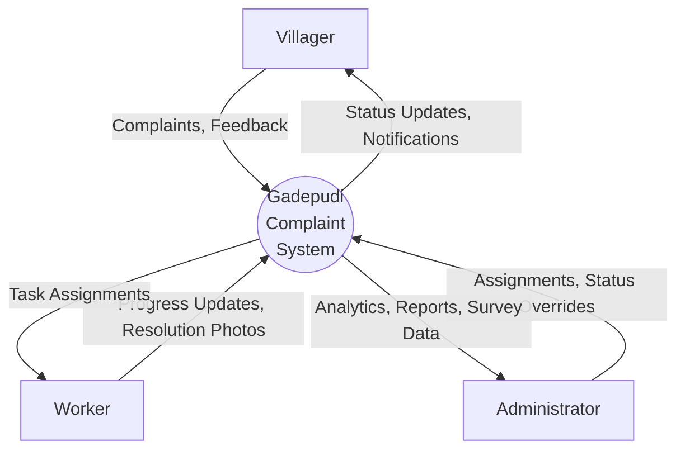
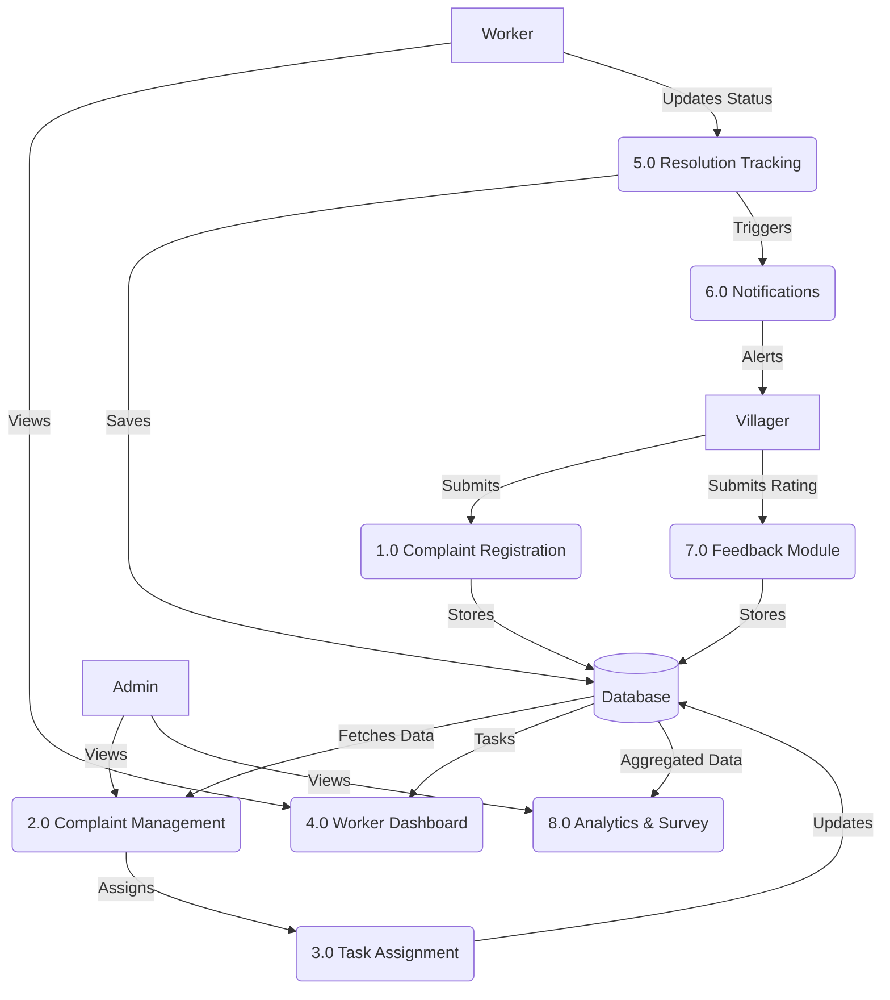
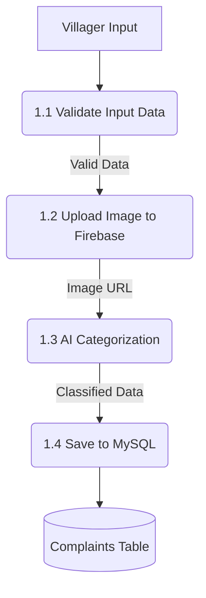

# Data Flow Diagrams (DFD)

## Level 0 (Context Diagram)

```mermaid
graph TD
    V[Villager] -->|Complaints, Feedback| System((Gadepudi\nComplaint\nSystem))
    System -->|Status Updates, Notifications| V

    W[Worker] -->|Progress Updates, Resolution Photos| System
    System -->|Task Assignments| W

    A[Administrator] -->|Assignments, Status Overrides| System
    System -->|Analytics, Reports, Survey Data| A
```

## Level 1 Diagram

```mermaid
graph TD
    V[Villager] -->|Submits| P1(1.0 Complaint Registration)
    P1 -->|Stores| DB[(Database)]
    
    A[Admin] -->|Views| P2(2.0 Complaint Management)
    DB -->|Fetches Data| P2
    P2 -->|Assigns| P3(3.0 Task Assignment)
    P3 -->|Updates| DB
    
    W[Worker] -->|Views| P4(4.0 Worker Dashboard)
    DB -->|Tasks| P4
    W -->|Updates Status| P5(5.0 Resolution Tracking)
    P5 -->|Saves| DB
    
    P5 -->|Triggers| P6(6.0 Notifications)
    P6 -->|Alerts| V
    
    V -->|Submits Rating| P7(7.0 Feedback Module)
    P7 -->|Stores| DB
    
    A -->|Views| P8(8.0 Analytics & Survey)
    DB -->|Aggregated Data| P8
```

## Level 2: Sub-process 1.0 (Complaint Registration)

```mermaid
graph TD
    V[Villager Input] --> P1_1(1.1 Validate Input Data)
    P1_1 -->|Valid Data| P1_2(1.2 Upload Image to Firebase)
    P1_2 -->|Image URL| P1_3(1.3 AI Categorization)
    P1_3 -->|Classified Data| P1_4(1.4 Save to MySQL)
    P1_4 --> DB[(Complaints Table)]
```
