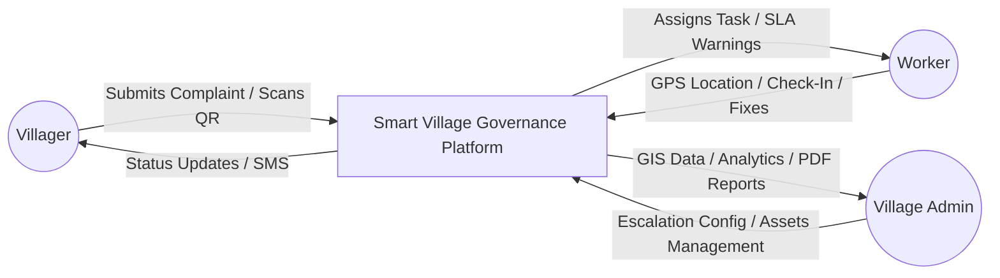
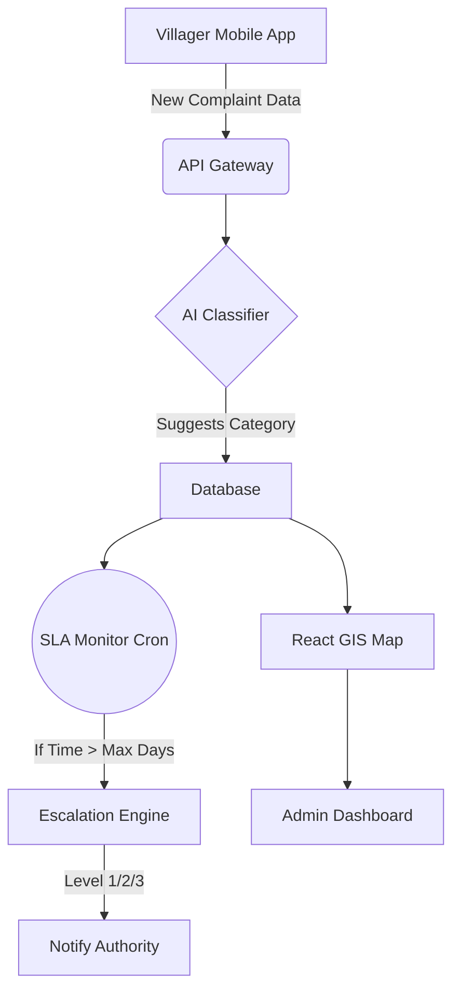

# Data Flow Diagrams (v2)

## Level 0 DFD (Context Diagram)

```mermaid
graph LR
    Villager((Villager))
    Worker((Worker))
    Admin((Village Admin))
    System[Smart Village Governance Platform]
    
    Villager -- Submits Complaint / Scans QR --> System
    System -- Status Updates / SMS --> Villager
    
    System -- Assigns Task / SLA Warnings --> Worker
    Worker -- GPS Location / Check-In / Fixes --> System
    
    System -- GIS Data / Analytics / PDF Reports --> Admin
    Admin -- Escalation Config / Assets Management --> System
```

## Level 1 DFD (Complaint Processing & Escalation)

```mermaid
graph TD
    A[Villager Mobile App] -->|New Complaint Data| B(API Gateway)
    B --> C{AI Classifier}
    C -->|Suggests Category| D[Database]
    
    D --> E((SLA Monitor Cron))
    E -->|If Time > Max Days| F[Escalation Engine]
    F -->|Level 1/2/3| G[Notify Authority]
    
    D --> H[React GIS Map]
    H --> I[Admin Dashboard]
```
