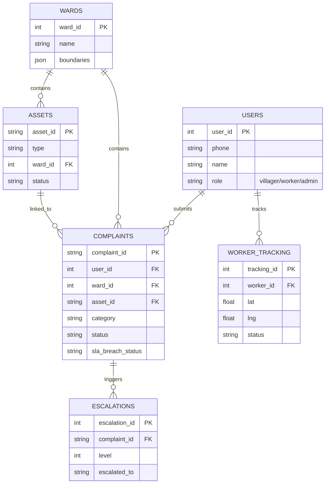

# Entity Relationship Diagram (v2)

This diagram includes the new tables for the Smart Village Governance Platform: Wards, Assets, SLAs, Escalations, and Worker Tracking.

```mermaid
erDiagram
    USERS {
        int user_id PK
        string phone
        string name
        string role "villager/worker/admin"
    }
    
    WARDS {
        int ward_id PK
        string name
        json boundaries
    }
    
    ASSETS {
        string asset_id PK
        string type
        int ward_id FK
        string status
    }
    
    COMPLAINTS {
        string complaint_id PK
        int user_id FK
        int ward_id FK
        string asset_id FK
        string category
        string status
        string sla_breach_status
    }
    
    ESCALATIONS {
        int escalation_id PK
        string complaint_id FK
        int level
        string escalated_to
    }
    
    WORKER_TRACKING {
        int tracking_id PK
        int worker_id FK
        float lat
        float lng
        string status
    }
    
    USERS ||--o{ COMPLAINTS : submits
    WARDS ||--o{ COMPLAINTS : contains
    WARDS ||--o{ ASSETS : contains
    ASSETS ||--o{ COMPLAINTS : linked_to
    COMPLAINTS ||--o{ ESCALATIONS : triggers
    USERS ||--o{ WORKER_TRACKING : tracks
```
